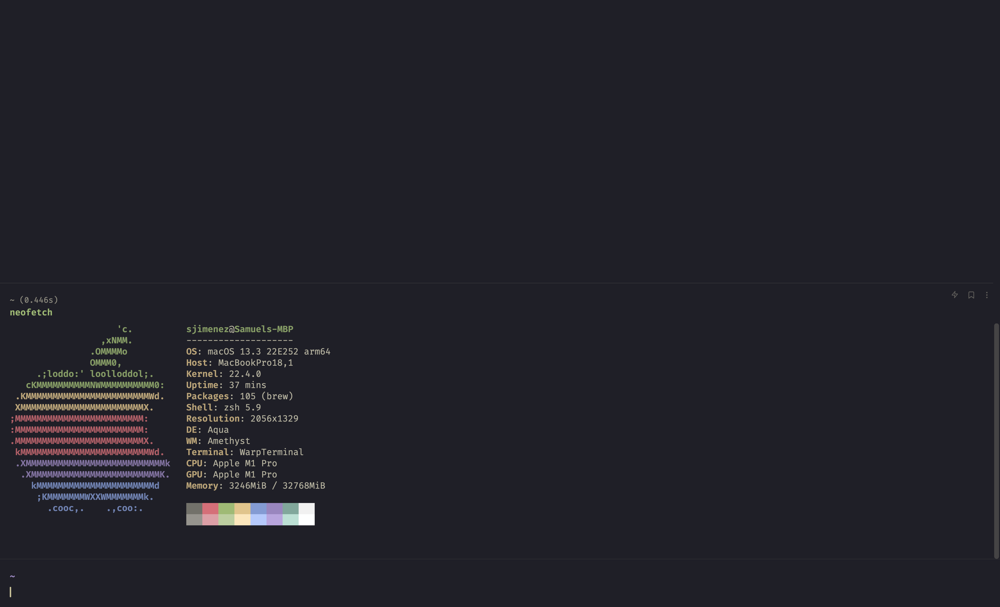
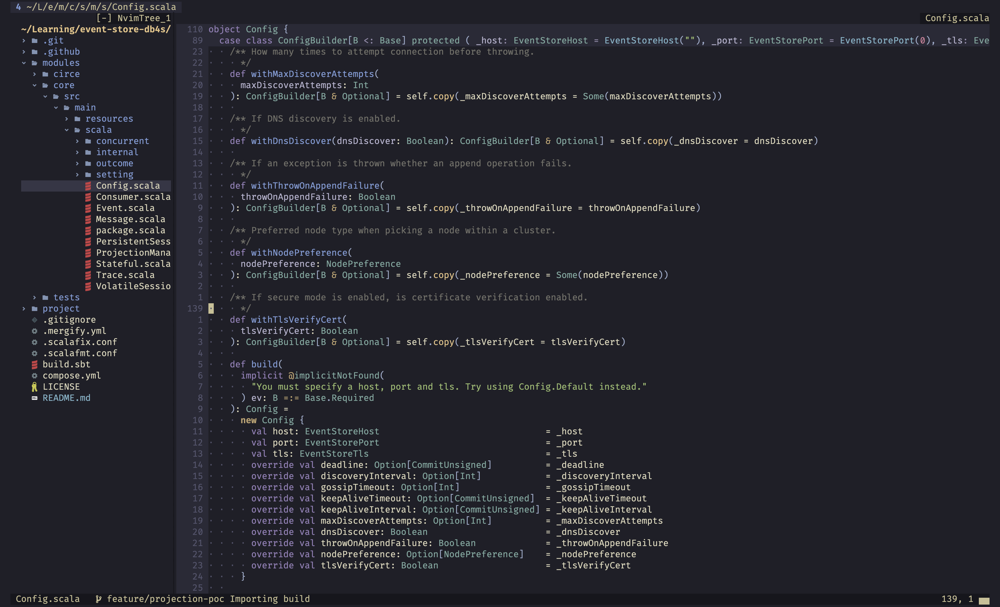

# Dotfiles

To see a full guide on how to use these configuration, please visit [install](./docs/INSTALL.md) page.

## What does this bundles? 

This is a list of what the `Brewfile` installs, some of them are not needed but I like to have them around. The ones
that are needed are marked with a `*`.

- git-lfs: Git Large File Storage (LFS) replaces large files such as audio samples, videos, datasets, and graphics with text pointers inside Git.
- neovim [*]: Vim-fork focused on extensibility and agility.
- gnupg [*] -> MacOS only: GnuPG is a complete and free implementation of the OpenPGP standard
- harfbuzz [*] -> MacOS only: HarfBuzz is a text shaping engine. It primarily supports OpenType, but also Apple Advanced Typography, Graphite2, and Uniscribe.
- jq [*]: Command-line JSON processor
- librdkafka: Apache Kafka C/C++ library
- kcat: Apache Kafka producer and consumer
- kubernetes-cli: Kubernetes command-line interface
- lua-language-server [*]: Lua language server
- node [*]: Node.js JavaScript runtime
- parallel: GNU Parallel is a shell tool for executing jobs in parallel using one or more processors.
- pinentry-mac [*] -> MacOS only: Pinentry for GnuPG using native Mac OS X dialogs
- podman: Podman is a daemonless, open source, Linux native tool designed to make it easy to find, run, build, share and deploy applications using Open Containers Initiative (OCI) Containers and Container Images.
- podman-compose: An implementation of Compose Spec with Podman backend.
- python@3.10 [*]: Python programming language
- ripgrep [*]: ripgrep recursively searches directories for a regex pattern
- rust-analyzer [*]: Rust analyzer
- yaml-language-server: YAML language server
- derailed/k9s/k9s: K9s is a terminal based UI to interact with your Kubernetes clusters.
- amethyst (MacOS): Amethyst is a tiling window manager for macOS that models many of its concepts after i3.
- warp (MacOS): Warp is a terminal for MacOS that makes you more productive.
- fzf: fzf is a general-purpose command-line fuzzy finder.

## How does it look like?

**Recommended [linux]**: If you're using i3 I highly recommend using [rofi](https://github.com/davatorium/rofi) and/or [xfce4-appfinder](https://gitlab.xfce.org/xfce/xfce4-appfinder) for apps and [pavucontrol](https://freedesktop.org/software/pulseaudio/pavucontrol/) for sound, since getting used to app names can be a bit hard at the beginning.  

**Note**: In case of running into issues such as `module packer not found` or whatever, go to the `packer.lua` file and remove everything but packer and run `:so` and `:PackerInstall` again. This will make sure that packer is installed correctly. Later on, you can add the plugins back.
